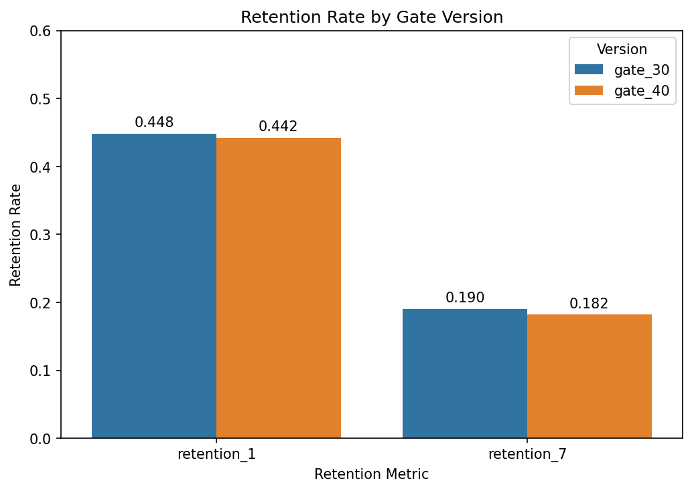

# Cookie Cats A/B Test: Gate Placement & Retention Analysis

## Business Question
Cookie Cats, a mobile puzzle game, gates player progress at a certain level to 
encourage breaks. This analysis tests whether moving that gate from level 30 
to level 40 affects player retention.

## Dataset
- Source: [Cookie Cats Kaggle Dataset](https://www.kaggle.com/datasets/mursideyarkin/mobile-games-ab-testing-cookie-cats)
- 90,189 players randomly assigned to gate_30 or gate_40
- Fields: userid, version, sum_gamerounds, retention_1, retention_7

## Methodology
1. Data quality check: identified and removed one extreme outlier 
   (49,854 game rounds, ~17x the next-highest player) as a likely bot 
   or test account
2. Two-proportion z-test on Day-1 and Day-7 retention between groups
3. 95% confidence interval on the Day-7 effect size
4. Retrospective power analysis to validate the reliability of the Day-1 
   null result

## Key Findings

| Metric | Gate 30 | Gate 40 | p-value | Significant? |
|---|---|---|---|---|
| Day-1 Retention | 44.82% | 44.23% | 0.074 | No |
| Day-7 Retention | 19.02% | 18.20% | 0.0016 | Yes |

- Day-7 retention was significantly higher for gate_30 (95% CI: 0.31–1.33 
  percentage points)
- Statistical power to detect a 1pp effect: 97%, confirming the Day-1 
  null result is trustworthy, not a sample size issue

## Recommendation
**Keep the gate at level 30.** The retention advantage is statistically 
significant, and although modest in absolute size, gate_40 offers no 
offsetting benefit to justify the loss.

## Limitations
- No monetization data (retention only, not spend)
- Outlier removal was a manual judgment call, not a defined statistical rule
- No segmentation by device, region, or player experience level
- No data on *why* players who left, left

## Tools
Python, Pandas, SciPy, Statsmodels, Matplotlib, Seaborn

## Repository Structure
```
├── cookie_cats_ab_test.ipynb   # Full analysis notebook
├── cookie_cats.csv             # Raw dataset
└── README.md
```
